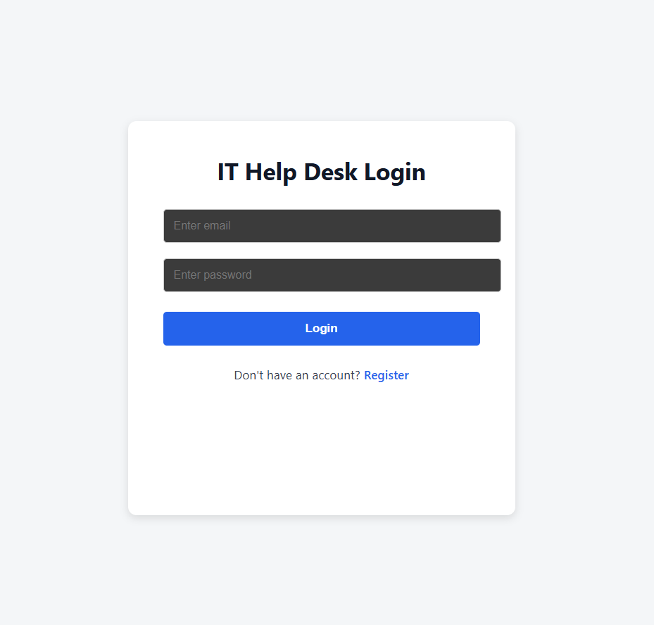
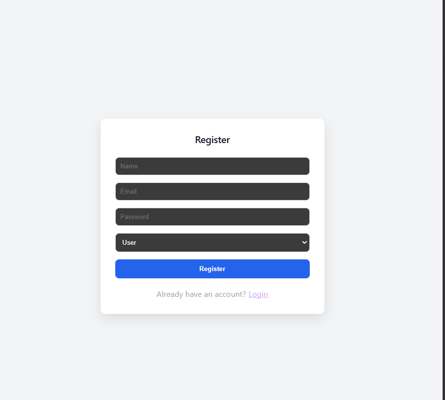
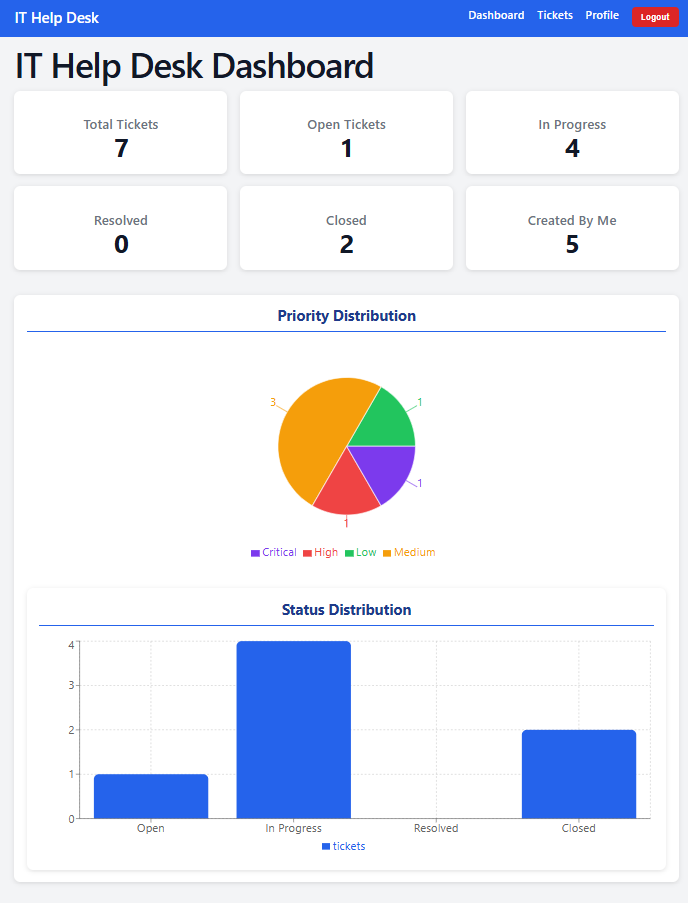
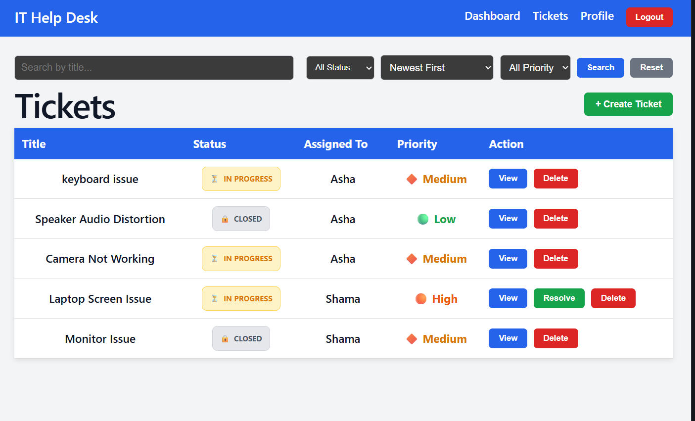
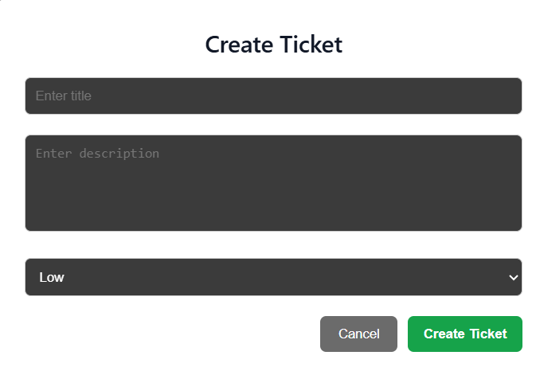
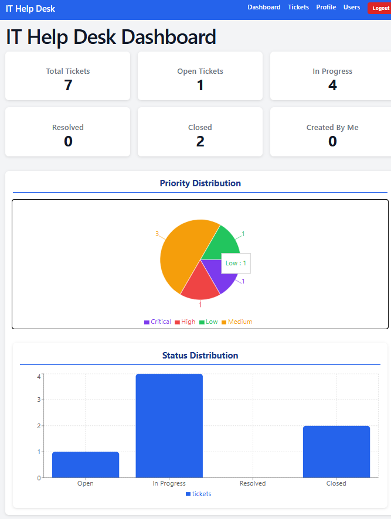
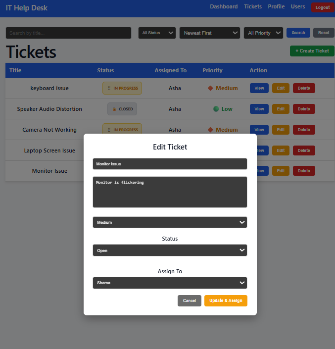

<div align="center">

# 🎫 IT Help Desk Ticketing System

### A Full-Stack MERN Application for Efficient IT Support Management

<p>


</p>


### 🚀 Live Demo

🌐 Frontend: https://it-help-desk-system1.vercel.app/

⚙️ Backend API: https://it-helpdesk-system1-production.up.railway.app

</div>

---

# 📖 Overview

The **IT Help Desk Ticketing System** is a full-stack MERN application designed to simplify IT support management.

Users can securely register, log in, create support tickets, track their requests, and communicate through comments. Administrators can view all tickets, update ticket statuses, and efficiently manage support requests.

The application follows RESTful API principles, uses JWT-based authentication for security, and stores data in MongoDB Atlas.

---

# ✨ Features

## 👤 User

- 🔐 Secure Registration & Login
- 🎫 Create Support Tickets
- 📋 View Personal Tickets
- ✏️ Update Ticket Status
- 💬 Add Comments
- 🚪 Logout Securely

## 👨‍💼 Admin

- 👥 View All Tickets
- 🔄 Update Ticket Status
- 💬 Comment on Tickets
- 📊 Monitor User Requests
- 🛡 Role-Based Access

---

# 🛠 Tech Stack

| Frontend | Backend | Database | Authentication |
|----------|----------|-----------|----------------|
| React.js | Node.js | MongoDB Atlas | JWT |
| Vite | Express.js | Mongoose | bcrypt |
| Axios | REST API | Cloud Database | Role-Based Access |

---

# 🏗 Project Structure

```text
IT-HelpDesk-System1
│
├── backend
│   ├── config
│   ├── controllers
│   ├── middleware
│   ├── models
│   ├── routes
│   ├── package.json
│   └── server.js
│
├── frontend
│   ├── public
│   ├── src
│   ├── package.json
│   └── vite.config.js
│
└── README.md
```

---

# 🚀 Getting Started

## Clone Repository

```bash
git clone https://github.com/Shamanettar-05/IT-HelpDesk-System1.git
cd IT-HelpDesk-System1
```

---

## Backend Setup

```bash
cd backend
npm install
```

Create a `.env` file

```env
PORT=5000
MONGO_URI=YOUR_MONGODB_CONNECTION_STRING
JWT_SECRET=YOUR_SECRET_KEY
```

Run the backend

```bash
npm start
```

---

## Frontend Setup

```bash
cd frontend
npm install
npm run dev
```

---

# 📡 API Endpoints

| Method | Endpoint | Description |
|---------|----------|-------------|
| POST | /register | Register a new user |
| POST | /login | User Login |
| GET | /tickets | Fetch Tickets |
| POST | /tickets | Create Ticket |
| PUT | /tickets/:id | Update Ticket |
| DELETE | /tickets/:id | Delete Ticket |

---

# 📸 Screenshots

### 🔐 Login Page



---

### 📝 Register Page



---

### 👤 User Dashboard



---

### 🎫 User Tickets



---

### ➕ Create Ticket



---

### 👨‍💼 Admin Dashboard



---

### 📋 Admin Ticket Management



---

# ⭐ Highlights

- ✅ Secure JWT Authentication
- ✅ Password Encryption using bcrypt
- ✅ RESTful API Architecture
- ✅ MongoDB Atlas Integration
- ✅ Role-Based Authorization
- ✅ Responsive User Interface
- ✅ Clean Folder Structure
- ✅ Full CRUD Operations

---

# 🔮 Future Improvements

- 📧 Email Notifications
- 📎 File Attachments
- ⚡ Ticket Priority Levels
- 📊 Dashboard Analytics
- 🌙 Dark Mode

---

# 👩‍💻 Author

**Shama Nettar**

Information Science & Engineering

GitHub: https://github.com/Shamanettar-05

---

<div align="center">

### ⭐ If you found this project useful, please consider giving it a Star!

Made with ❤️ by **Shama Nettar**

</div>
